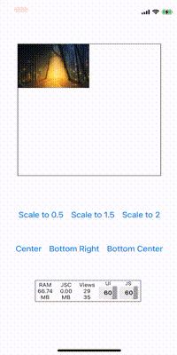

# react-native-pan-pinch-view
<a href="https://www.npmjs.com/package/react-native-pan-pinch-view">
    
</a>

A view component for React Native with pinch to zoom and drag to pan functionality.

 


## 👋 Introduction

Even though the demo shows the library used with images, it was initially designed to show `<View>`s representing blueprints of rooms. 

- Pinch to zoom with two fingers
- Drag one finger to pan
- Keep content inside container boundaries
- Configurable minimum and maximum scale
- Methods for programmatically updating position and scale

Thanks to `react-native-reanimated` all animations are running on the UI thread, so no fps drops are experienced.

If you want to zoom in on images *exclusively*, in a gallery-like UI, I recommend these packages, rather than my library:

- [`react-native-awesome-gallery`](https://github.com/Flair-Dev/react-native-awesome-gallery)
- [`react-native-image-zoom`](https://github.com/likashefqet/react-native-image-zoom)


## 👀 Prerequisites

This library uses `react-native-reanimated` v3 and the latest API of `react-native-gesture-handler`.

Before installing it, you need to install those two libraries and set them up in your project:

- `react-native-reanimated@3.3.0`: [installation & setup](https://docs.swmansion.com/react-native-reanimated/)
- `react-native-gesture-handler@2.13.2`: [installation & setup](https://docs.swmansion.com/react-native-gesture-handler/docs/#installation)

## ⚙️ Installation

```sh
npm install react-native-pan-pinch-view
```

## ✂️ Usage

```js
import PanPinchView from "react-native-pan-pinch-view";

// ...

const CONTAINER = {
  width: 300,
  height: 300,
};

const CONTENT = {
  width: 900,
  height: 400,
};
// ...

<PanPinchView
  minScale={1}
  initialScale={1}
  containerDimensions={{
    width: CONTAINER.width,
    height: CONTAINER.height,
  }}
  contentDimensions={{ width: CONTENT.width, height: CONTENT.height }}
>
  <Image
    style={[styles.image]}
    source={require('./assets/photo.jpg')}
  />
</PanPinchView>

// ...

const styles = StyleSheet.create({
  image: {
    width: CONTENT.width,
    height: CONTENT.height,
  },
});

```

## ⚪ Props

| Property              | Type      | Default                          | Description                                                                                                        |
|-----------------------|-----------|----------------------------------|--------------------------------------------------------------------------------------------------------------------|
| containerDimensions   | Object    | `{width: number, height:number}` | Width and height of the viewable area.                                                                             |
| contentDimensions     | Object    | `{width: number, height:number}` | Width and height of the zoomable view.                                                                             |
| minScale              | Number?   | `0.5`                            | Minimum value of scale.                                                                                            |
| maxScale              | Number?   | `4`                              | Maximum value of scale.                                                                                            |
| initialScale          | Number?   | `1`                              | Initial value of scale.                                                                                            |
| onTranslationFinished | Function? | `undefined`                      | Function to be called on the JS thread with an object containing current position and whether it was clamped (X/Y) |

## 🛠 Methods

| Method         | Params                                  | Return | Description                                                                                  |
|----------------|-----------------------------------------|--------|----------------------------------------------------------------------------------------------|
| scaleTo        | value: number, animated: boolean        | void   | Sets sharedValue `scale` to  `value`,<br/> if `animated` is **true** uses `withTiming`       |
| setContentSize | width: number, height: number           | void   | Updates sharedValue `contentSize` and overrides prop: `contentDimensions`                    |
| translateTo    | x: number, y: number, animated: boolean | void   | Updates content `translateX` / `translateY`, <br>if `animated` is **true** uses `withTiming` |
| setMinScale    | value: number                           | void   | Updates `minScale` value                                                                     |
| setMaxScale    | value: number                           | void   | Updates `maxScale` value                                                                     |
| getScale       |                                         | number | Returns current value of sharedValue `scale`                                                 |

You can also refer to the app inside `example/` for a running demo of this library.

## Contributing

See the [contributing guide](CONTRIBUTING.md) to learn how to contribute to the repository and the development workflow.

## License

MIT
